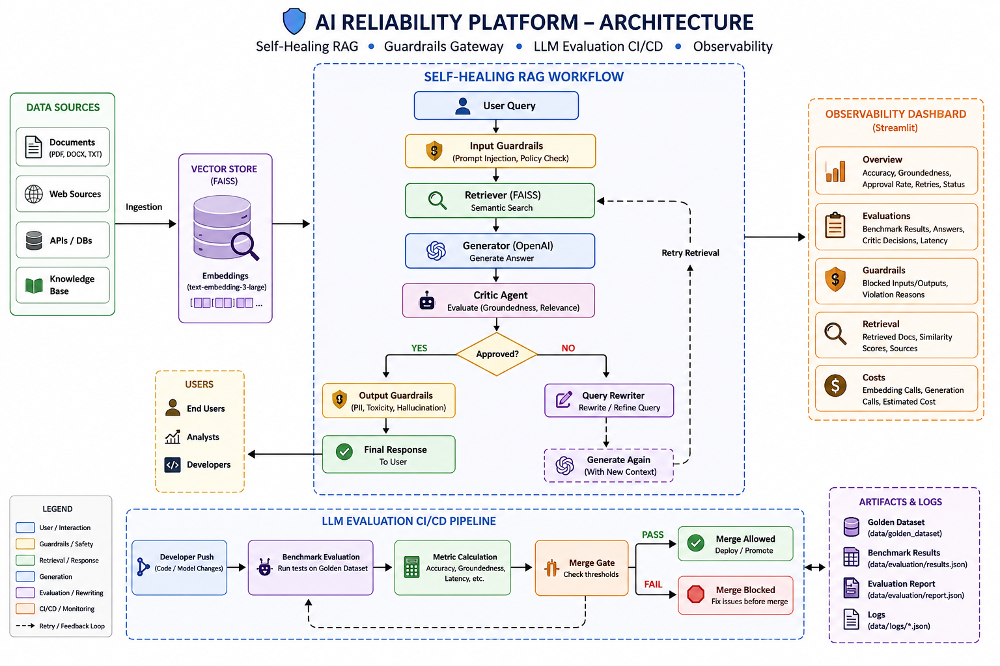
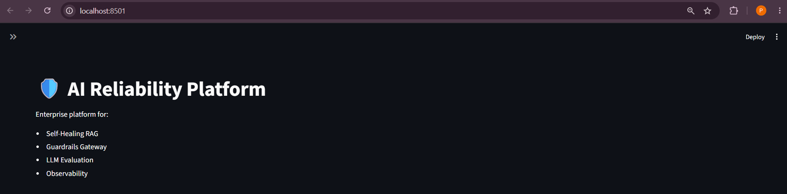
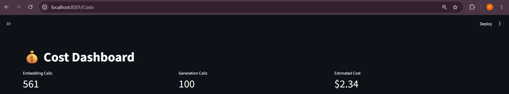
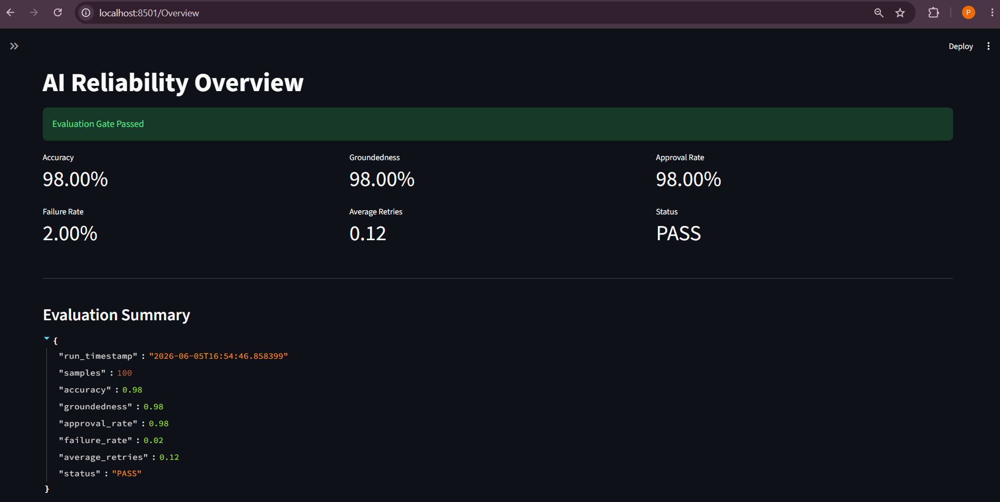
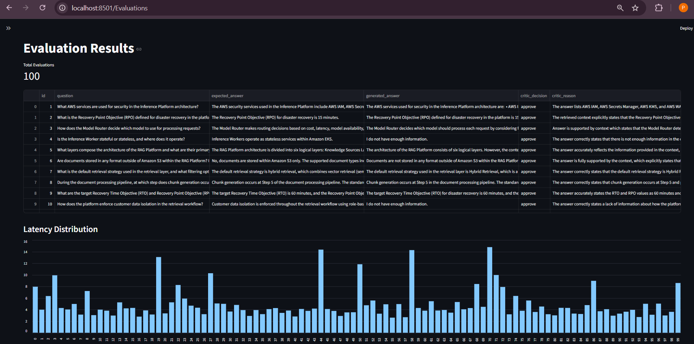
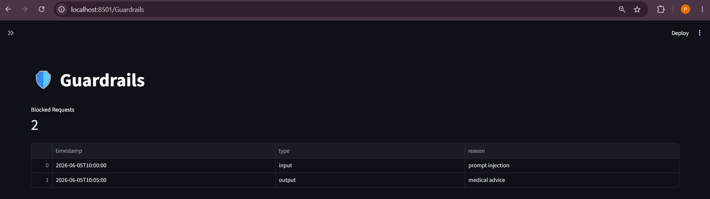
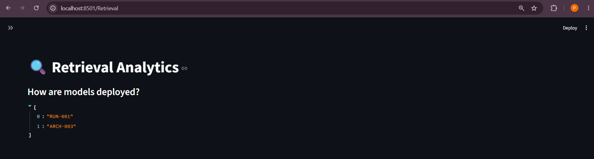

# 🛡️ AI Reliability Platform

Enterprise-grade AI Reliability Platform that combines:

- 🔄 Self-Healing RAG
- 🛡️ Guardrails Gateway
- 📊 LLM Evaluation CI/CD
- 📈 Retrieval Analytics
- 💰 Cost Monitoring
- 🔍 AI Observability

Built using LangGraph, OpenAI, FAISS, Streamlit, and GitHub Actions.

---

# 🚀 Features

## 1. Self-Healing RAG

A retrieval-augmented generation workflow with automatic recovery mechanisms.

### Workflow

```text
User Query
↓
Retriever
↓
Generator
↓
Critic Agent
↓
Approved? ─── Yes → Response
│
No
↓
Query Rewriter
↓
Retry Retrieval
↓
Generate Again
```

### Capabilities

- Semantic search with FAISS
- Context-aware answer generation
- Groundedness evaluation
- Automatic retry loop
- Query rewriting
- Hallucination reduction

---

## 2. Guardrails Gateway

Protects the AI system from unsafe inputs and outputs.

### Input Guardrails

- Prompt Injection Detection
- Jailbreak Detection
- Restricted Topic Detection
- Policy Validation

### Output Guardrails

- Hallucination Checks
- Sensitive Content Detection
- Unsafe Response Blocking
- Policy Enforcement

### Policy Engine

Policies are managed through YAML configuration.

Example:

```yaml
blocked_topics:
  - hacking
  - malware
  - illegal activity

max_query_length: 500
```

---

## 3. LLM Evaluation CI/CD

Automated quality evaluation pipeline for GenAI applications.

### Components

- Golden Dataset Generation
- Benchmark Runner
- Critic Evaluation
- Metrics Calculation
- Merge Gate Validation

### Metrics

- Accuracy
- Groundedness
- Approval Rate
- Failure Rate
- Retry Count
- Latency

---

## 4. GitHub Merge Gate

Automatically blocks deployments when evaluation quality drops below threshold.

### Example Rule

```python
if accuracy < 0.90:
    fail_pipeline()

if groundedness < 0.90:
    fail_pipeline()
```

### CI/CD Flow

```text
Developer Push
↓
Benchmark Evaluation
↓
Metric Calculation
↓
Merge Gate
↓
PASS → Merge Allowed
FAIL → Merge Blocked
```

---

## 5. Retrieval Analytics

Provides visibility into RAG performance.

### Insights

- Retrieved Documents
- Source Traceability
- Retrieval Quality
- Query Analysis
- Context Inspection

---

## 6. Cost Monitoring

Tracks LLM operational costs.

### Metrics

- Embedding Calls
- Generation Calls
- Estimated Cost
- Usage Trends

---

# 🏗️ Architecture

```text
                    ┌─────────────────┐
                    │     User        │
                    └────────┬────────┘
                             │
                             ▼
                 ┌──────────────────────┐
                 │ Input Guardrails     │
                 └────────┬─────────────┘
                          │
                          ▼
                 ┌──────────────────────┐
                 │ Retriever (FAISS)    │
                 └────────┬─────────────┘
                          │
                          ▼
                 ┌──────────────────────┐
                 │ Generator (OpenAI)   │
                 └────────┬─────────────┘
                          │
                          ▼
                 ┌──────────────────────┐
                 │ Critic Agent         │
                 └────────┬─────────────┘
                          │
             ┌────────────┴────────────┐
             │                         │
             ▼                         ▼
         APPROVE                    REJECT
             │                         │
             ▼                         ▼
 ┌──────────────────┐      ┌──────────────────┐
 │ Output Guardrail │      │ Query Rewriter   │
 └─────────┬────────┘      └─────────┬────────┘
           │                         │
           ▼                         ▼
      Final Response         Retry Retrieval
                                      │
                                      ▼
                              Generate Again
```




---

# 📊 Dashboard

The platform includes a Streamlit dashboard with:

### Overview

- Accuracy
- Groundedness
- Approval Rate
- Retry Metrics
- Evaluation Status

### Evaluations

- Benchmark Results
- Generated Answers
- Critic Decisions
- Latency Distribution

### Guardrails

- Blocked Requests
- Violation Reasons
- Input/Output Monitoring

### Retrieval

- Retrieved Documents
- Source Analysis
- Retrieval Inspection

### Cost Dashboard

- Embedding Usage
- Generation Usage
- Estimated Spend

---

# 🛠️ Tech Stack

## AI / LLM

- OpenAI
- LangGraph

## Retrieval

- FAISS
- Vector Search

## Backend

- Python
- FastAPI

## Evaluation

- Golden Dataset Testing
- Automated Benchmarking

## Dashboard

- Streamlit
- Plotly

## CI/CD

- GitHub Actions

---

# 📂 Project Structure

```text
AI-Reliability-Platform
│
├── app
│   ├── graph
│   ├── rag
│   ├── guardrails
│   └── evaluation
│
├── dashboard
│   ├── app.py
│   └── pages
│
├── data
│   ├── documents
│   ├── vectors
│   ├── evaluation
│   └── golden_dataset
│
├── scripts
├── tests
│
├── .github
│   └── workflows
│
├── requirements.txt
└── README.md
```

---

# ⚙️ Installation

## Clone Repository

```bash
git clone https://github.com/<username>/ai-reliability-platform.git

cd ai-reliability-platform
```

## Create Virtual Environment

```bash
python -m venv venv

source venv/bin/activate
```

Windows:

```bash
venv\Scripts\activate
```

## Install Dependencies

```bash
pip install -r requirements.txt
```

## Configure Environment

Create `.env`

```env
OPENAI_API_KEY=your_key_here
```

---

## ▶️ Run Ingestion

```bash
python -m scripts.ingest
```

---

## ▶️ Run Benchmark

```bash
python -m app.evaluation.benchmark
```

---

## ▶️ Run Evaluation

```bash
python -m app.evaluation.evaluator
```

---

## ▶️ Run Merge Gate

```bash
python -m app.evaluation.merge_gate
```

---

## ▶️ Launch Dashboard

```bash
streamlit run dashboard/app.py
```

---

# 📈 Sample Evaluation Results

| Metric | Value |
|----------|----------|
| Accuracy | 98% |
| Groundedness | 98% |
| Approval Rate | 98% |
| Failure Rate | 2% |
| Average Retries | 0.12 |
| Status | PASS |

---

# 🎯 Key Highlights

- Enterprise-grade Self-Healing RAG
- Automated LLM Evaluation Pipeline
- GitHub Merge Gate for AI Quality
- Prompt Injection Protection
- Hallucination Detection
- Retrieval Observability
- Cost Monitoring Dashboard
- LangGraph Workflow Orchestration

# Screenshots

## Landing Page



## Cost Dashboard



## Overview Dashboard



## Evaluation Dashboard



## Guardrails Dashboard



## Retrieval Dashboard



---

# 👨‍💻 Author

Pooja

---

# ⭐ Future Enhancements

- LangSmith Tracing
- MLflow Integration
- OpenTelemetry Metrics
- AWS Deployment
- Multi-LLM Routing
- Human Feedback Loop (RLHF)
- Agentic Evaluation Framework

---